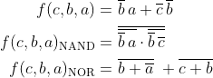
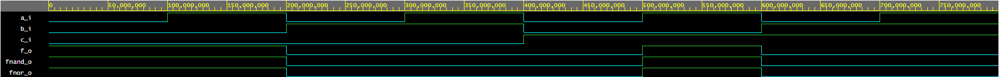
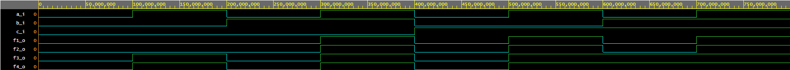

# Digital-electronics-1
## gates-01

### My github profile
https://github.com/ZukyFresh/Digital-electronics-1

## Verifications of basic Boolean postulates



### Logical table

| **c** | **b** |**a** | **f(c,b,a)** |
| :-: | :-: | :-: | :-: |
| 0 | 0 | 0 | 1 |
| 0 | 0 | 1 | 1 |
| 0 | 1 | 0 | 0 |
| 0 | 1 | 1 | 0 |
| 1 | 0 | 0 | 0 |
| 1 | 0 | 1 | 1 |
| 1 | 1 | 0 | 0 |
| 1 | 1 | 1 | 0 |

### Architecture body for basic gates in VHDL

```vhdl
architecture dataflow of gates is
begin
    f_o  <= ((not b_i) and a_i) or ((not c_i) and (not b_i));
    fnand_o <= not (not (not b_i and a_i) and not(not b_i and not c_i));
    fnor_o <= (not (b_i or not a_i)) or (not (c_i or b_i));

end architecture dataflow;
```

### Simulated time waveforms



### EDA playground example link

https://www.edaplayground.com/x/fmSH

## Verification of Distributive laws

### Equations


### Logical table

| **c** | **b** |**a** | **a and b or a and c** | **a and (b or c)** | **(a or b) and (a or c)**  | **a or (b and c)**  |
| :-: | :-: | :-: | :-: | :-: | :-: | :-: |
| 0 | 0 | 0 | 0 | 0 | 0 | 0 |
| 0 | 0 | 1 | 0 | 0 | 1 | 1 |
| 0 | 1 | 0 | 0 | 0 | 0 | 0 |
| 0 | 1 | 1 | 1 | 1 | 1 | 1 |
| 1 | 0 | 0 | 0 | 0 | 0 | 0 |
| 1 | 0 | 1 | 1 | 1 | 1 | 1 |
| 1 | 1 | 0 | 0 | 0 | 1 | 1 |
| 1 | 1 | 1 | 1 | 1 | 1 | 1 |

### VHDL code

```vhdl
architecture dataflow of gates is
begin
    f1_o <= (a_i and b_i)or(a_i and c_i);
	f2_o <= (a_i and (b_i or c_i));
	f3_o <= (a_i or b_i) and (a_i or c_i);
	f4_o <= a_i or (b_i and c_i);

end architecture dataflow;

```

### Simulated time waveforms



### EDA playground example link

https://www.edaplayground.com/x/t7nP
