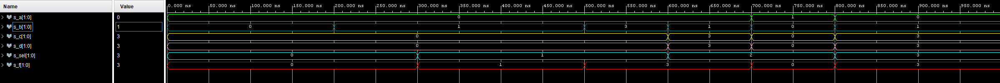
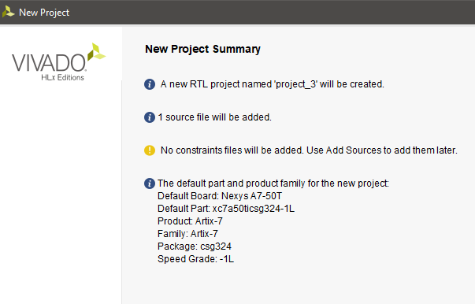
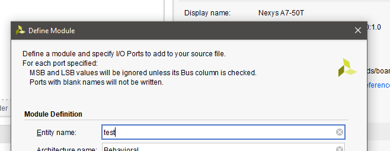
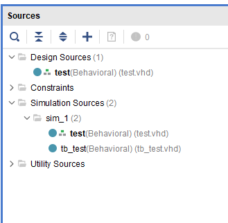

##Table with connection (16 switches & 16 LEDs)

| **LED** | **Conn** | **Switch** | **Conn** | 
| :-: | :-: | :-: | :-: |
| LED0 | H17 | SW0 | J15 |
| LED1 | K15 | SW1 | L16 |
| LED2 | J13 | SW2 | M13 |
| LED3 | N14 | SW3 | R15 |
| LED4 | R18 | SW4 | R17 |
| LED5 | V17 | SW5 | T18 |
| LED6 | U17 | SW6 | U18 |
| LED7 | U16 | SW7 | R13 |
| LED8 | V16 | SW8 | T8 |
| LED9 | T15 | SW9 | U8 |
| LED10 | U14 | SW10 | R16 |
| LED11 | T16 | SW11 | T13 |
| LED12 | V15 | SW12 | H6 |
| LED13 | V14 | SW13 | U12 |
| LED14 | V12 | SW14 | U11 |
| LED15 | V11 | SW15 | V10 |

## Two-bit wide 4-to-1 multiplexer

### VHDL architecture (`mux_2bit_4to1.vhd`)

```vhdl
architecture Behavioral of mux_2bit_4to1 is
begin
    f_o <=  a_i when (sel_i = "00") else
            b_i when (sel_i = "01") else
            c_i when (sel_i = "10") else
            d_i;

end architecture Behavioral;
```

### VHDL stimulus process  (`tb_mux_2bit_4to1.vhd`)

```vhdl
p_stimulus : process
    begin
        report "Stimulus process started" severity note;

  
        s_d <= "00"; s_c <= "00"; s_b <= "00"; s_a <= "00"; s_sel <= "00"; wait for 100 ns;
        
        s_a <= "00"; wait for 100 ns;
        s_b <= "01"; wait for 100 ns;
        
        s_sel <= "01"; wait for 100 ns;
        s_c <= "00"; wait for 100 ns;
        s_b <= "11"; wait for 100 ns;  
        
        s_d <= "11";  s_c <= "11"; s_b <= "01"; s_a <= "00"; 
        s_sel <= "10"; wait for 100 ns;  
        
        s_d <= "00";  s_c <= "00"; s_b <= "00"; s_a <= "01"; 
        s_sel <= "10"; wait for 100 ns;  
        
        s_d <= "11";  s_c <= "11"; s_b <= "01"; s_a <= "00"; 
        s_sel <= "11"; wait for 100 ns;  
        
        report "Stimulus process finished" severity note;
        wait;
    end process p_stimulus;

end architecture testbench;
```


### Waveforms screens



## Vivado tutorial

Click on New Project.

Now click on Next>.
Name you project and click on Next>.
Select RTL Project and click on Next>.


Add sources by clicking on Create File and then click on Next>.
(type VHDL, location = <Local to Project>)

In Boards choose Nexys A7-50T and than click on Next>.


Finish the project summary.

Now define module.

Add source => Add or create simulation sources and then click on Next>.
Create a source file and then click on Finish.
Everything should be ready.


