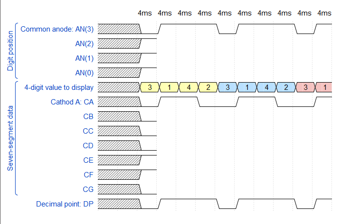
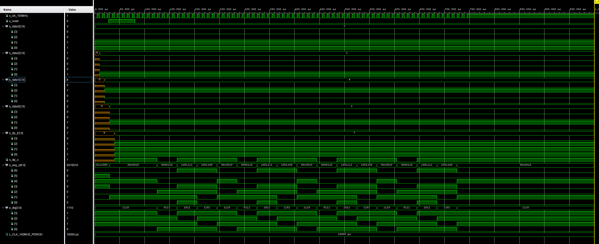
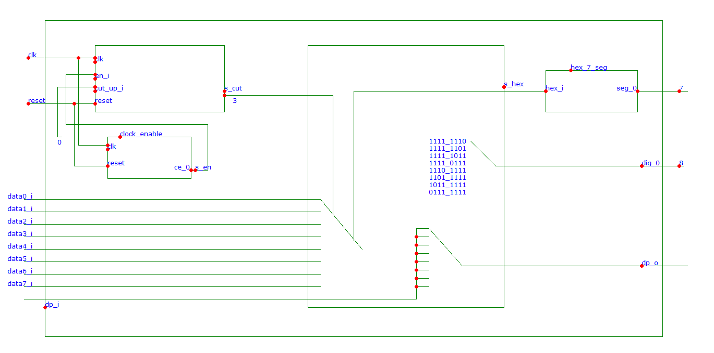

### Timing diagram figure for displaying value (3.142)

```javascript
{
  signal:
  [
    ['Digit position',
      {name: 'Common anode: AN(3)', wave: 'xx01..01..01'},
      {name: 'AN(2)', wave: 'xx1'},
      {name: 'AN(1)', wave: 'xx1'},
      {name: 'AN(0)', wave: 'xx1'},
    ],
    ['Seven-segment data',
      {name: '4-digit value to display', wave: 'xx3333555599', data: ['3','1','4','2','3','1','4','2','3','1']},
      {name: 'Cathod A: CA', wave: 'xx01.0.1.0.1'},
      {name: 'CB', wave: 'xx0'},
      {name: 'CC', wave: 'xx0'},
      {name: 'CD', wave: 'xx0'},
      {name: 'CE', wave: 'xx1'},
      {name: 'CF', wave: 'xx1'},
      {name: 'CG', wave: 'xx0'},
    ],
    {name: 'Decimal point: DP', wave: 'xx01..01..01'},
  ],
  head:
  {
    text: '                    4ms   4ms   4ms   4ms   4ms   4ms   4ms   4ms   4ms   4ms',
  },
}
```

#### Figure image



## Display driver

### VHDL code of `p_mux` process

```vhdl
    p_mux : process(s_cnt, data0_i, data1_i, data2_i, data3_i, dp_i)
    begin
        case s_cnt is
            when "11" =>
                s_hex <= data3_i;
                dp_o  <= dp_i(3);
                dig_o <= "0111";

            when "10" =>
                s_hex <= data2_i;
                dp_o  <= dp_i(2);
                dig_o <= "1011";

            when "01" =>
                s_hex <= data1_i;
                dp_o  <= dp_i(1);
                dig_o <= "1101";

            when others =>
                s_hex <= data0_i;
                dp_o  <= dp_i(0);
                dig_o <= "1110";
        end case;
    end process p_mux;

end architecture Behavioral;
```

### VHDL code of `tb_driver_7seg_4digits` process

```vhdl
   p_stimulus : process
    begin
        report "Stimulus process started" severity note;

        report "Testing 3" severity note;
        s_data3 <= "0011";
        wait for 10 ns;
        assert (s_seg_o = "0000110")
        report "Test failed for input combination: 3" severity error;
        
        report "Testing 1" severity note;
        s_data2 <= "0001";
        wait for 10 ns;
        assert (s_seg_o = "1001111")
        report "Test failed for input combination: 1" severity error; 
        
        report "Testing 4" severity note;
        s_data1 <= "0100";
        wait for 10 ns;
        assert (s_seg_o = "1001100")
        report "Test failed for input combination: 4" severity error; 
        
        report "Testing 2" severity note;
        s_data0 <= "0010";
        wait for 10 ns;
        assert (s_seg_o = "0010010")
        report "Test failed for input combination: 2" severity error; 
               
        s_dp_i <= "0111";

        report "Stimulus process finished" severity note;
        wait;
    end process p_stimulus;
end architecture testbench;
```

### Screenshot of waveforms



### VHDL code architecture of `top.vhd`

```vhdl
architecture Behavioral of top is
    
begin
    driver_seg_4 : entity work.driver_7seg_4digits
        port map(
            clk        => CLK100MHZ,
            reset      => BTNC,
            data0_i(3) => SW(3),
            data0_i(2) => SW(2),
            data0_i(1) => SW(1),
            data0_i(0) => SW(0),
            
            data1_i(3) => SW(7),
            data1_i(2) => SW(6),
            data1_i(1) => SW(5),
            data1_i(0) => SW(4),
            
            data2_i(3) => SW(11),
            data2_i(2) => SW(10),
            data2_i(1) => SW(9),
            data2_i(0) => SW(8),
            
            data3_i(3) => SW(15),
            data3_i(2) => SW(14),
            data3_i(1) => SW(13),
            data3_i(0) => SW(12),
            
            dp_i => "0111",
            dp_o => DP,
            
            seg_o(6) => CA,
            seg_o(5) => CB,
            seg_o(4) => CC,
            seg_o(3) => CD,
            seg_o(2) => CE,
            seg_o(1) => CF,
            seg_o(0) => CG,
            
            dig_o => AN(4 - 1 downto 0)
        );
    AN(7 downto 4) <= b"1111";

end architecture Behavioral;
```

## Eight-digit driver

### Driver schematic image

